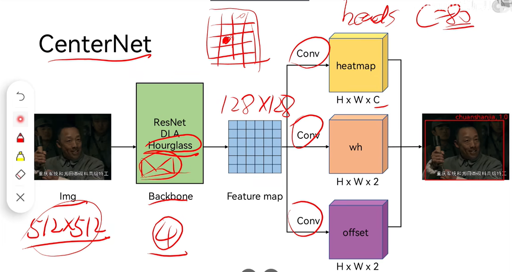

#  [CenterNet](https://arxiv.org/abs/1904.07850)

[B站讲解视频1](https://www.bilibili.com/video/BV1r44y1a75j/?spm_id_from=333.337.search-card.all.click&vd_source=42f1e486842e9add1356fbbd0f4159f3)

[B站讲解视频2，本项目中采用的代码基于此视频](https://www.bilibili.com/video/BV1mK411u77S/?spm_id_from=333.337.search-card.all.click&vd_source=42f1e486842e9add1356fbbd0f4159f3)

[参考文档](./code/img/CenterNet_doc.pdf)

## 1. Network
 - Backbone: [ResNet](), [Hourglass](), [Deep Layer Aggregation]()
 - [Decoder](): UpSample + BN + Activation作为一个block，以此堆叠三次作为一个Decoder。其中CenterNet的UpSample为反卷积，激活函数为ReLU。需要注意的是，三个反卷积的核大小都为4x4，卷积核的数目分别为256，128，64。那么经过Decoder之后，feature map的宽高维度则变为原来1/4（比较重要，后面会反复用到），通道维度为64。

 - Head:


## 2 Loss function
- CIOU（Complete Intersection over Union）
## 3 Annotation

## 4 [Code](https://github.com/bubbliiiing/centernet-pytorch)
### 4.1 Environment setup (x86)
- Docker pull
    - ` $ sudo docker pull nvidia/cuda:11.4.3-cudnn8-devel-ubuntu20.04`
- 启动镜像
    - `$ sudo docker run --name torch1.13.1 -itd  -v /home/ntueee/yangjianbing:/root/code -p 2002:22   -e NVIDIA_DRIVER_CAPABILITIES=compute,utility --gpus all --shm-size="12g" --restart=always nvidia/cuda:11.4.3-cudnn8-devel-ubuntu20.04`
- Install ssh (Note that enter container first!)
    - `$ apt-get update`
    - `$ apt-get install vim`
    - `$ apt-get install openssh-server`
    - 设置root密码，后续登录会用到: `$ passwd`
    - 修改配置文件: `$ vim /etc/ssh/sshd_config`
        ``` 
        #PermitRootLogin prohibit-password
        PermitRootLogin yes
        UsePAM yes 修改为 no
        注释这一行PermitRootLogin prohibit-password
        添加一行PermitRootLogin yes
        UsePAM yes 修改为 no #禁用PAM
        ```
    - 重启ssh服务: `$ service ssh restart`
    - 添加开机启动
        - 新建`power_launch.sh`文件，放到根目录：`/root`下，`power_launch.sh`添加如下内容
            ```
            #!/bin/sh -e
            service ssh start &
            ```
        - 获取读写权限：`chmod 777 /root/power_launch.sh`
        - 编辑`~/.bashrc`: `vim ~/.bashrc`，在下面添加
            ```
            if [ -f /root/power_launch.sh ]; then
                    ./root/power_launch.sh
            fi
            ```
- Install pytorch 1.13
    - 创建python软链接：`$ ln -s /usr/bin/python3 /usr/bin/python` （注意python的版本，下载pytorch时要对应）
    - install pip package: `apt-get install pip`
    - 下载[cu116/torch-1.13.0%2Bcu116-cp38-cp38-linux_x86_64.whl](https://download.pytorch.org/whl/cu116/torch-1.13.0%2Bcu116-cp38-cp38-linux_x86_64.whl)，安装：`pip install torch-1.13.0+cu116-cp38-cp38-linux_x86_64.whl`
    - 下载[cu116/torchvision-0.14.0%2Bcu116-cp38-cp38-linux_x86_64.whl](https://download.pytorch.org/whl/cu116/torchvision-0.14.0%2Bcu116-cp38-cp38-linux_x86_64.whl)，安装：`pip install torchvision-0.14.0+cu116-cp38-cp38-linux_x86_64.whl`
    - 测试是否用的GPU：
        ```
        import torch
        flag = torch.cuda.is_available()
        if flag:
            print("CUDA is available")
        else:
            print("CUDA is not available")
        ```
- Install COCO API
    - pip install Cython
    - pip install pycocotools==2.0.0

- Install dependence
    - apt update && apt install -y libsm6 libxext6
    - apt-get install -y libxrender-dev
    - cd 01-ObjectDetection/CenterNet/code
    - pip install -r requirements.txt
### 4.2 Object detection (x86)
#### 4.2.1 Train 
- 制作训练标签 (`.txt` file)
    ```
    1、训练标签
    每行：image_path x_min,y_min,x_max,y_max,cls x_min,y_min,x_max,y_max,cls ... (注意：类别标签从0开始，如果有10个类，则类别为 0, 1, 2, 3, 4, 5, 6, 7, 8, 9)

    For example (train.txt): 
    /dir/000014.jpg 72,163,302,228,5 185,194,500,316,6 416,180,500,222,6 314,8,344,65,14 331,4,361,61,14 357,8,401,61,0
    /dir/000015.jpg 77,136,360,358,1

    2、类别标签 (`.txt` file)，如果是10个类
    cls0
    cls1
    cls2
    cls3
    cls4
    cls5
    cls6
    cls7
    cls8
    cls9

    For example (class.txt):
    aerop
    bicyc
    bird
    boat
    bottl
    bus
    car
    cat
    chair
    cow
    ```
- COCO格式的训练标签生成，在`code/generate_train_label`目录下找到[coco_annotation.py](code/generate_train_label/coco_annotation.py)，指令如下：
    ```
    python coco_annotation.py --ann_dir coco标签的存储路径 --ann_name coco标签的名称 --label_save_dir 生成训练标签的存储路径 --label_save_name 生成训练标签的存储名称 --class_names 生成coco中类别文件的存储名称 --images_dir 训练图像的存储目录
    
    For example:
    python coco_annotation.py --ann_dir /root/code/dataset/annotations --ann_name instances_train2017.json --label_save_dir /root/code/dataset/annotations --label_save_name instances_train2017.txt --class_names coco_classes.txt --images_dir /root/code/dataset/train2017
    ```

- 运行训练代码
    - 在`code`目录下新建`model_data`和`logs`文件夹：`mkdir model_data`, `mkdir logs` 
    - 将[预训练模型](https://pan.baidu.com/s/1DkJUkFT3i0jK4W7Qsu0yOA )(提取码：1234)拷贝到`model_data`
    - 在`code`目录下找到`train.py`文件，修改相关参数：
        ```
        classes_path = "第一步‘制作训练标签’中的‘类别标签’路径"
        model_path = "预训练模型路径"
        train_annotation_path = "第一步‘制作训练标签’中的‘训练标签’路径"
        val_annotation_path = "第一步‘制作训练标签’中的‘训练标签’路径"

        Init_Epoch = 0，UnFreeze_Epoch = 100，Freeze_Train = False，optimizer_type = 'adam'，Init_lr = 5e-4，weight_decay = 0。（不冻结）
        注: 1）模型从主干的预训练权值开始训练，则设置model_path = ''，pretrain = True，此时仅加载主干(就是说：如果你想从imagenet的主干网络权重开始训练，则需要设置model_path = ''，pretrain = True)；
            2）如果设置了model_path，则主干的权值无需加载，pretrained的值无意义；
            3）如果不设置model_path，pretrained = False，Freeze_Train = Fasle，此时从0开始训练，且没有冻结主干的过程。
        Unfreeze_batch_size = 32 （根据显存大小设置，越大越好）
        ```
    - `cd code`
    - `python train.py`
#### 4.2.2 Forward 
- (x86)
    - 在`code`目录下找到`centernet.py`，修改相关参数：
        ```
        "model_path": "模型路径"
        "classes_path": "第一步‘制作训练标签’中的‘类别标签’路径"
        ```
    - 在`code`目录下找到`predict.py`，修改相关参数：
        ```
        将mode设置为predict
        mode = "predict"
        ```
    - `cd code`
    - `python predict.py`
    - 预测成功后，会在`img_out`目录下生成`results.jpg`
- arm

#### 4.2.3 Estimation

#### 4.2.4 convert to onnx

#### 4.2.5 onnx convert to trt

### 4.3 Keypoint detection (x86)
#### 4.3.1 Train 
- 制作训练标签 (`.json` file)
    ```
    1、训练标签
    dict={'image1_path': [[x1,y1,cls,index], [x2,y2,cls,index], ...], 'image2_path': [[x1,y1,cls,index], [x2,y2,cls,index], ...]}

    Description：
    key: image_path;
    value: list，where, the list contain several sub lists. The elements of sub list are x , y, cls and index. Note that 1) cls start from 0，if there are 10 classes in dataset，the cls is 0, 1, 2, 3, 4, 5, 6, 7, 8, 9; 2) Index only avaliable in container corener point detection. Or use -1 to respresent the index

    For example (train.json): 
    {"train01/image_0000000432.jpeg": [["4", "2", 0, "0"]], 
     "train01/image_0000000523.jpeg": [["4", "2", 0, "1"], ["2", "7", 0, "0"], ["1", "9", 0, "0"], ["3", "0", 0, "0"], ["2", "4", 0, "0"], ["2", "2", 0, "0"], ["2", "7", 0, "0"], ["5", "1", 0, "0"], ["5", "5", 0, "0"], ["5", "3", 0, "0"], ["4", "3", 0, "0"], ["4", "4", 0, "0"], ["4", "8", 0, "0"], ["4", "8", 0, "0"], ["3", "9", 0, "0"], ["2", "7", 0, "0"], ["2", "1", 0, "0"]], 
     "train01/image_0000000524.jpeg": [["4", "2", 0, "1"]], 
     "train01/image_0000000525.jpeg": [["4", "2", 0, "1"]], 
     "train01/image_0000000526.jpeg": [["4", "2", 0, "1"]], 
     "train01/image_0000000527.jpeg": [["4", "2", 0, "1"]], 
     "train01/image_0000000528.jpeg": [["4", "2", 0, "1"]], 
     "train01/image_0000000529.jpeg": [["4", "2", 0, "1"]], 
     "train01/image_0000000530.jpeg": [["4", "2", 0, "1"]], 
     "train01/image_0000000531.jpeg": [["4", "2", 0, "1"]]}

    2、类别标签 (`.txt` file)，如果是10个类
    cls0
    cls1
    cls2
    cls3
    cls4
    cls5
    cls6
    cls7
    cls8
    cls9

    For example (class.txt):
    aerop
    bicyc
    bird
    boat
    bottl
    bus
    car
    cat
    chair
    cow
    ```
- COCO格式的训练标签生成，在`code/generate_train_label`目录下找到[coco_keypoint_annotation.py](code/generate_train_label/coco_keypoint_annotation.py)，指令如下：
    ```
    python coco_keypoint_annotation.py --dataset_dir 图像存储目录 --ann_dir coco标签的存储路径 --ann_name coco标签的名称 --label_save_dir 生成训练标签的存储路径 --label_save_name 生成训练标签的存储名称 --class_names 生成coco中类别文件的存储名称 
    
    For example:
    python coco_keypoint_annotation.py --dataset_dir /root/code/dataset/val2017 --ann_dir /root/code/dataset/annotations --ann_name person_keypoints_val2017.json --label_save_dir /root/code/AI-Note-Demo/01-ObjectDetection/CenterNet/code/img_out --label_save_name person_keypoints_val2017.json --class_names person_keypoints_classes.txt 
    ```

- `CVAT for images 1.1`格式的训练标签生成，在`code/generate_train_label`目录下找到[cvat_kepoint_annotation.py](code/generate_train_label/cvat_kepoint_annotation.py)，指令如下：
    ```
    python cvat_kepoint_annotation.py --dataset_dir 图像存储目录 --ann_dir cvat标签的存储路径 --ann_name 标签的名称 --label_save_dir 生成训练标签的存储路径 --label_save_name 生成训练标签的存储名称 --class_names 生成coco中类别文件的存储名称 
    
    For example:
    python cvat_kepoint_annotation.py --dataset_dir /dataset/train01 --ann_dir /root/code/dataset/annotations --ann_name annotations.xml --label_save_dir /root/code/dataset/annotations --label_save_name train.json --class_names classes.txt
    ```

- 注：若要训练`container corner`和`cell guide`数据集，则需要进行如下步骤
    - 原因：`container corner`和`cell guide`为小目标，直接使用数据集训练难以识别。采用随机裁剪的策略，生成裁剪后的数据集和对应的`标签`（格式为上述的` Keypoint detection`格式）。因此，新生成的数据集`可直接导入训练`。
    - 运行随机裁剪脚本[crop_cell_guide_and_container_corner.py](code/generate_train_label/crop_cell_guide_and_container_corner.py)生成裁剪后的数据集，指令如下：
        ```
        python crop_cell_guide_and_container_corner.py --label_path 需要裁剪数据集的annotation标签（格式为上述的 Keypoint detection 格式，不是这种格式的话，用上面给出的代码自己转下） --class_name_path 需要裁剪数据集的类别标签（上述的.txt文件格式）--crop_dataset_save_dir 生成的裁剪数据集的存储目录 --train_val 存储裁剪图片文件夹的名称 --crop_label_name annotation的存储名称（.json） --crop_class_name 类别的存储名称（.txt） --crop_num 每个目标随机裁剪的数量

        For example:
        python crop_cell_guide_and_container_corner.py --label_path /root/code/AI-Note-Demo/01-ObjectDetection/CenterNet/code/img_out/cell_guide_contanier_corner/CellGuideContainerCorner_val01.json --class_name_path /root/code/AI-Note-Demo/01-ObjectDetection/CenterNet/code/img_out/cell_guide_contanier_corner/CellGuideContainerCorner.txt --crop_dataset_save_dir /root/code/AI-Note-Demo/01-ObjectDetection/CenterNet/code/img_out/Crop_CellGuideContainerCorner --train_val val_v1 --crop_label_name Crop_CellGuideContainerCorner_val01.json --crop_class_name crop_classes.txt --crop_num 10
        ```

- 运行`训练`代码
    - 在`code`目录下新建`model_data`和`logs`文件夹：`mkdir model_data`, `mkdir logs` 
    - 将`预训练模型`拷贝到`model_data`
    - 在`code`目录下找到`train_keypoints.py`文件，修改相关参数：
        ```
        classes_path = "第一步‘制作训练标签’中的‘类别标签’路径"
        model_path = "预训练模型路径"
        train_annotation_path = "第一步‘制作训练标签’中的‘训练标签’路径"
        val_annotation_path = "第一步‘制作训练标签’中的‘训练标签’路径"

        Init_Epoch = 0，UnFreeze_Epoch = 100，Freeze_Train = False，optimizer_type = 'adam'，Init_lr = 5e-4，weight_decay = 0。（不冻结）
        注: 1）模型从主干的预训练权值开始训练，则设置model_path = ''，pretrain = True，此时仅加载主干(就是说：如果你想从imagenet的主干网络权重开始训练，则需要设置model_path = ''，pretrain = True)；
            2）如果设置了model_path，则主干的权值无需加载，pretrained的值无意义；
            3）如果不设置model_path，pretrained = False，Freeze_Train = Fasle，此时从0开始训练，且没有冻结主干的过程。
        Unfreeze_batch_size = 32 （根据显存大小设置，越大越好）
        ```
    - `cd code`
    - `python train_keypoints.py`

#### 4.3.2 Forward 
- (x86)
    - 在`code`目录下找到`centernet_keypoints.py`，修改相关参数：
        ```
        "model_path": "模型路径"
        "classes_path": "第一步‘制作训练标签’中的‘类别标签’路径"
        ```
    - 在`code`目录下找到`predict_keypoints.py`，修改相关参数：
        ```
        将mode设置为predict
        mode = "predict" # 不裁剪预测视频 mode = "video"； 裁剪预测视频 mode = "video_crop"
        ```
    - `cd code`
    - `python predict_keypoints.py --video_image_path xxxxx(需要测试图片或视频的路径)`
    - 预测成功后，会在`img_out`目录下生成`results.jpg`
- arm