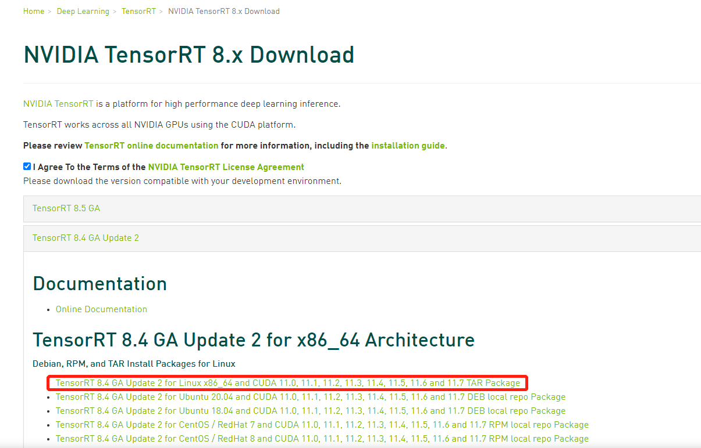
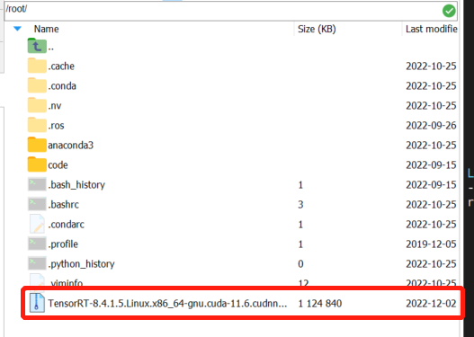
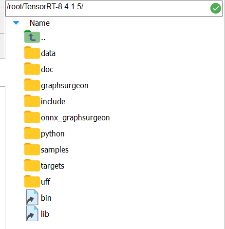

# zpmc_yolact_trt
若使用已配置好的镜像，则跳过第“一、环境安装”，拉取启动镜像指令如下：
- 拉取镜像
```
$ sudo docker pull 10.128.231.44/tensorrt/tensorrt8.4.1.5-ros-anaconda-base-cuda-11.6.0-cudnn8-devel-ubuntu20.04:v1.1
```
- 启动镜像
```
$ sudo docker run --name zpmc_trt84 -itd -v /software:/software -p 2223:22  -e NVIDIA_DRIVER_CAPABILITIES=compute,utility --gpus all --shm-size="12g" --restart=always 10.128.231.44/tensorrt/tensorrt8.4.1.5-ros-anaconda-base-cuda-11.6.0-cudnn8-devel-ubuntu20.04:v1.1
```

## Environment setup (x86)
- Docker pull
    - ` $ sudo docker pull nvidia/cuda:11.4.3-cudnn8-devel-ubuntu20.04`
- 启动镜像
    - `$ sudo docker run --name yoloact_trt -itd -v /home/ntueee/yangjianbing:/root/code -p 2004:22 -e NVIDIA_DRIVER_CAPABILITIES=compute,utility --gpus all --shm-size="12g" --restart=always nvidia/cuda:11.4.3-cudnn8-devel-ubuntu20.04`
- 进入镜像   
    `sudo docker exec -it yoloact_trt /bin/bash`
- Install ssh (Note that enter container first!)
    - `$ apt-get update`
    - `$ apt-get install vim`
    - `$ apt-get install openssh-server`
    - 设置root密码，后续登录会用到: `$ passwd`
    - 修改配置文件: `$ vim /etc/ssh/sshd_config`
        ``` 
        #PermitRootLogin prohibit-password
        PermitRootLogin yes
        UsePAM yes 修改为 no
        注释这一行PermitRootLogin prohibit-password
        添加一行PermitRootLogin yes
        UsePAM yes 修改为 no #禁用PAM
        ```
    - 重启ssh服务: `$ service ssh restart`
    - 添加开机启动
        - 新建`power_launch.sh`文件，放到根目录：`/root`下，`power_launch.sh`添加如下内容
            ```
            #!/bin/sh -e
            service ssh start &
            ```
        - 获取读写权限：`chmod 777 /root/power_launch.sh`
        - 编辑`~/.bashrc`: `vim ~/.bashrc`，在下面添加
            ```
            if [ -f /root/power_launch.sh ]; then
                    ./root/power_launch.sh
            fi
            ```

- Install dependence
    - apt update && apt install -y libsm6 libxext6
    - apt-get install -y libxrender-dev
    - apt install libgl1-mesa-glx
    - cd 02-Segmetation/yolact_trt/requirements.txt

- 下载[Tensorrt](https://developer.nvidia.com/nvidia-tensorrt-8x-download)，如下图所示：

    
- [安装Tensorrt](https://docs.nvidia.com/deeplearning/tensorrt/install-guide/index.html#installing-tar)
- 将下载好的Tenosrrt的.tar.gz压缩包拷贝到镜像中的/root目录下，如下图所示：

    
- 解压Tenosrrt的.tar.gz压缩包
    ```
    $ tar -xzvf TensorRT-8.4.1.5.Linux.x86_64-gnu.cuda-11.6.cudnn8.4.tar.gz
    ```
- 解压后的Tensorrt文件构成如下图所示：

    

- 添加环境变量：在~/.bashrc中加入如下代码：
    ```
    $ export LD_LIBRARY_PATH=$LD_LIBRARY_PATH:/root/TensorRT-8.4.1.5/targets/x86_64-linux-gnu/lib
    ```
- 安装Python TensorRT wheel（选择对应的python版本），指令如下：
    ```
    $ cd /root/TensorRT-8.4.1.5/python
    $ python -m pip install tensorrt-8.4.1.5-cp37-none-linux_x86_64.whl #如果出现 Certificate verification failed报错，可以用下面指令替换
    $ python -m pip --trusted-host pypi.python.org --trusted-host pypi.tuna.tsinghua.edu.cn install tensorrt-8.4.1.5-cp37-none-linux_x86_64.whl -i https://pypi.tuna.tsinghua.edu.cn/simple/
    ```
- 安装UFF wheel，指令如下：
    ```
    $ cd .. 
    $ cd uff
    $ python -m pip --trusted-host pypi.python.org --trusted-host pypi.tuna.tsinghua.edu.cn install uff-0.6.9-py2.py3-none-any.whl -i https://pypi.tuna.tsinghua.edu.cn/simple/
    ```
- 安装graphsurgeon wheel，指令如下：
    ```
    $ cd .. 
    $ cd graphsurgeon
    $ python -m pip --trusted-host pypi.python.org --trusted-host pypi.tuna.tsinghua.edu.cn install graphsurgeon-0.4.6-py2.py3-none-any.whl -i https://pypi.tuna.tsinghua.edu.cn/simple/
    ```
- 安装onnx-graphsurgeon wheel，指令如下：
    ```
    $ cd .. 
    $ cd onnx_graphsurgeon
    $ python -m pip --trusted-host pypi.python.org --trusted-host pypi.tuna.tsinghua.edu.cn install onnx_graphsurgeon-0.3.12-py2.py3-none-any.whl -i https://pypi.tuna.tsinghua.edu.cn/simple/
    ```

- 安装cuda-python(注意：python>=3.7)，指令如下：
    ```
    $ pip --trusted-host pypi.python.org --trusted-host pypi.tuna.tsinghua.edu.cn install cuda-python -i https://pypi.tuna.tsinghua.edu.cn/simple/
    ```
- 安装pycuda
    ```
    $ pip --trusted-host pypi.python.org --trusted-host pypi.tuna.tsinghua.edu.cn install pycuda -i https://pypi.tuna.tsinghua.edu.cn/simple/

    若报src/cpp/cuda.hpp:14:10: fatal error: cuda.h: No such file or directory错误，解决方法：在~/.bashrc中添加export PATH=/usr/local/cuda-11.6/bin:$PATH。添加完成后，记得source ~/.bashrc
    ```
- 安装opencv-python， 指令如下：
    ```
    $ pip --trusted-host pypi.python.org --trusted-host pypi.tuna.tsinghua.edu.cn install opencv-python -i https://pypi.tuna.tsinghua.edu.cn/simple/
    ```

## 二、推理
- 在zpmc_yolact_trt84下创建onnx文件夹，用于存储onnx模型
    ```
    $ mkdir onnx
    ```
- 下载[onnx文件]()
- 将下载到```onnx文件```拷贝到```onnx文件夹```
- 下载[测试视频]()
- 16位推理
    ``` 
    $ python zpmc_yolact_trt.py --onnxFile onnx/yolact.onnx --trtFile_save_dir trt --trtFile_save_name yolact16.trt --FPMode FP16 --video_dir /software/temp/firstlanding_demo --detect_save_dir result

    # --onnxFile：onnx文件的保存路径
    # --trtFile_save_dir：将要生成的trt文件保存目录
    # --trtFile_save_name：将要生成的trt文件保存名称
    # --FPMode：保存浮点数32位或16位
    # --video_dir：测试视频的存储目录
    # --detect_save_dir：推理结果的保存目录
    ```

- 32位推理
    ``` 
    $ python zpmc_yolact_trt.py --onnxFile onnx/yolact.onnx --trtFile_save_dir trt --trtFile_save_name yolact32.trt --FPMode FP32 --video_dir /software/temp/firstlanding_demo --detect_save_dir result

    # --onnxFile：onnx文件的保存路径
    # --trtFile_save_dir：将要生成的trt文件保存目录
    # --trtFile_save_name：将要生成的trt文件保存名称
    # --FPMode：保存浮点数32位或16位
    # --video_dir：测试视频的存储目录
    # --detect_save_dir：推理结果的保存目录
    ```