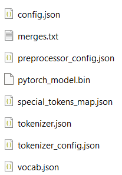
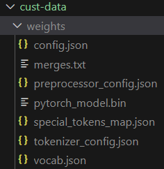
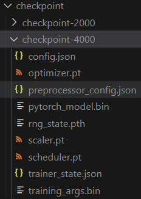
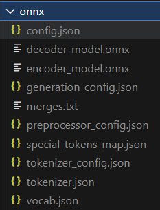

## 一、Environment setup (x86)
### 1.1 直接下载配置好的docker image
- 下载[trocr-train.tar](https://pan.baidu.com/s/19XZRPTYUtQlGITCewEDcOA), 提取码: 1234 
- 载入镜像
    `sudo docker load -i xxx/trocr-train.tar`
- 启动镜像
    `$ sudo docker run --name trocr -itd  -v /home/ntueee/yangjianbing:/root/code -p 2019:22 -e NVIDIA_DRIVER_CAPABILITIES=compute,utility --gpus all --shm-size="12g" --restart=always nvidia-cuda-11.4.3-cudnn8-devel-ubuntu20.04-torch-1.13.0:trocr`


### 1.2 自己配
- Docker pull
    - ` $ sudo docker pull nvidia/cuda:11.4.3-cudnn8-devel-ubuntu20.04`
- 启动镜像
    - `$ sudo docker run --name trocr -itd  -v /home/ntueee/yangjianbing:/root/code -p 2019:22 -e NVIDIA_DRIVER_CAPABILITIES=compute,utility --gpus all --shm-size="12g" --restart=always nvidia/cuda:11.4.3-cudnn8-devel-ubuntu20.04`
- Install ssh (Note that enter container first!)
    - `$ apt-get update`
    - `$ apt-get install vim`
    - `$ apt-get install openssh-server`
    - 设置root密码，后续登录会用到: `$ passwd`
    - 修改配置文件: `$ vim /etc/ssh/sshd_config`
        ``` 
        #PermitRootLogin prohibit-password
        PermitRootLogin yes
        UsePAM yes 修改为 no
        注释这一行PermitRootLogin prohibit-password
        添加一行PermitRootLogin yes
        UsePAM yes 修改为 no #禁用PAM
        ```
    - 重启ssh服务: `$ service ssh restart`
    - 添加开机启动
        - 新建`power_launch.sh`文件，放到根目录：`/root`下，`power_launch.sh`添加如下内容
            ```
            #!/bin/sh -e
            service ssh start &
            ```
        - 获取读写权限：`chmod 777 /root/power_launch.sh`
        - 编辑`~/.bashrc`: `vim ~/.bashrc`，在下面添加
            ```
            if [ -f /root/power_launch.sh ]; then
                    ./root/power_launch.sh
            fi
            ```
- Install pytorch 1.13
    - 创建python软链接：`$ ln -s /usr/bin/python3 /usr/bin/python` （注意python的版本，下载pytorch时要对应）
    - install pip package: `apt-get install pip`
    - 下载[cu116/torch-1.13.0%2Bcu116-cp38-cp38-linux_x86_64.whl](https://download.pytorch.org/whl/cu116/torch-1.13.0%2Bcu116-cp38-cp38-linux_x86_64.whl)，安装：`pip install torch-1.13.0+cu116-cp38-cp38-linux_x86_64.whl`
    - 下载[cu116/torchvision-0.14.0%2Bcu116-cp38-cp38-linux_x86_64.whl](https://download.pytorch.org/whl/cu116/torchvision-0.14.0%2Bcu116-cp38-cp38-linux_x86_64.whl)，安装：`pip install torchvision-0.14.0+cu116-cp38-cp38-linux_x86_64.whl`
    - 测试是否用的GPU：
        ```
        import torch
        flag = torch.cuda.is_available()
        if flag:
            print("CUDA is available")
        else:
            print("CUDA is not available")
        ```
- Install COCO API
    - pip install Cython
    - pip install pycocotools==2.0.0

- Install dependence
    - apt update && apt install -y libsm6 libxext6
    - apt-get install -y libxrender-dev
    - cd xxx/AiEngineering/03-OCR/trocr && pip install -r requirements.txt

## 二、数据集
### 2.1 数据集格式
- image和annotation存储在同一个文件夹中（image和annotation的名称要相同），比如：文件夹`0`, `1`, ..., `100`，每个文件夹中都有名称相同的image和annotation（image和annotation的名称可以跟文件夹的名称不相同）。
    ```
    my_dataset/0/0.jpg
    my_dataset/0/0.txt
    ...
    my_dataset/100/10000.jpg
    my_dataset/100/10000.txt
    ```
- 图片只有`一行`字符串，如下图所示
    - `fig1.jpg`
        
    - `fig2.jpg`    
        
- `.txt`中的内容必须只有`一行`，例如：
    - `fig1.txt`的内容为：  
        `FCIU5223429`
    - `fig2.txt`的内容为：  
        `8427435`
    - 注意：
        - 1）如果想识别`空格`，标注的时候，需要加入空格，如：`842 7435`
        - 2）如果不想识别`空格`，标注的时候，就不需要加入空格了

### 2.2 这里提供了一个数据集转换脚本[dataset_convert](cust-data/dataset_convert.py)，不过它只能处理如下格式的数据：
- 待转换的数据集`annotation`是`json`文件，内容如下：
    ```
    {"000000001.jpg": "22G1", "000000002.jpg": "CSLU2212491", "000000003.jpg": "22G1", "000000004.jpg": "CSLU1650873", "000000005.jpg": "22G1", "000000006.jpg": "EGHU3626325", "000000007.jpg": "8427435", ...}

    是个dict，key：图片的名称，value：标注内容
    ```
- 待转换的图片存在同一个文件夹中，且图片只有`一行`字符串，如上述的`fig1.jpg`和`fig2.jpg`
- 注意：
    - 1）[dataset_convert](cust-data/dataset_convert.py)的line6，`Define_str`指的是数据集中包含的字符类型，它的作用是去除那些标注错误的image和annotation，`Define_str`根据你自己的数据集修改；
    - 2）[dataset_convert](cust-data/dataset_convert.py)会自动去除annotation中的`空格`，如果你想保留annotation中的`空格，你需要自己写个转换脚本。
- 运行指令，例：
    ```
    cd trocr/cust-data

    python dataset_convert.py --input_dataset_dir /root/code/dataset/containercode/text_rec/train --input_ann_path /root/code/dataset/containercode/text_rec/ann/train.json --output_dataset_dir /root/code/AiEngineering/03-OCR/trocr/dataset/cust-data/train

    参数解释：
    --input_dataset_dir：数据集图片存储的目录
    --input_ann_path：数据集annotation存储的路径
    --output_dataset_dir：输出符合“2.1 数据集格式”数据集的存储目录

    最后会在--output_dataset_dir下生成“2.1 数据集格式”所述的数据集
    ```
### 2.3 生成训练模型所需的字符文件`vocab.txt`（这一步必须做）
- [gen_vocab.py](gen_vocab.py)，该脚本用于遍历数据集（格式同`2.1 数据集格式`中所述的）中所有的annotation，找出所有类别的`字符`,并将这些字符存储成`vocab.txt`
- 运行指令
    ```
    cd trocr
    python gen_vocab.py --dataset_path "/root/code/AiEngineering/03-OCR/trocr/dataset/cust-data/train/*/*.txt" --cust_vocab "./cust-data/vocab.txt"

    参数解释：
    --dataset_path：数据集下所有的annotation（.txt）文件
    --cust_vocab：存储vocab.txt的路径

    注意：指令中的字符串加上“”，不然有可能会报bash: /usr/bin/python: Argument list too long的错误
    ```
- 注意：
    - 1）在你的训练集，测试集，验证集上都跑一遍。因为如果你的数据集比较小，单个的训练集，测试集，验证集中可能并没有完全函数所有的字符，生成的vocab.txt都检查下，确保字符全（不全的话，汇总下，手动补全）；
    - 2）每运行一次指令，生成的vocab.txt，里面字符的顺序都会变化。因此，生成一次后，就不要重复生成，不然会对后续的推理、部署有影响
## 三、预训练模型trocr模型权重
- [下载:hand-write.zip](https://pan.baidu.com/s/1jz_FuqamlNNs7KxGRQ9FYQ), 提取码: 1234 

- 解压`hand-write.zip`，得到如下文件：  
    

- 在`trocr`新建`weights`文件夹
- 将解压`hand-write.zip`得到的文件拷贝到`weights`文件夹下
- 生成`预训练模型trocr模型权重`指令如下：
    ```
    cd trocr

    python init_custdata_model.py --cust_vocab ./cust-data/vocab.txt --pretrain_model ./weights --cust_data_init_weights_path ./cust-data/weights
    
    参数解释：
    --cust_vocab：词库文件，即2.3节中生成的`vocab.txt`文件的路径   
    --pretrain_model：预训练模型权重，即上述新建的`weights`文件夹路径
    --cust_data_init_weights_path：自定义模型初始化模型权重保存路径
    ```
- 指令运行结束后，会在`--cust_data_init_weights_path`路径下生成如下文件：  
    

## 四、训练
- 指令如下：
    ```
    cd trocr
    python train.py --cust_data_init_weights_path ./cust-data/weights --checkpoint_path ./checkpoint --dataset_path "/root/code/AiEngineering/03-OCR/trocr/dataset/cust-data/train/*/*.jpg" --per_device_train_batch_size 8 --CUDA_VISIBLE_DEVICES 0

    参数解释：
    --cust_data_init_weights_path：上节中生成的预训练模型权重的存储路径
    --checkpoint_path：训练权重的保存路径
    --dataset_path：数据集的存储路径
    ```

- 训练时，程序会将训练的数据分成train set和test set, [train.py](train.py), line55处。若报train set和test set划分的错误，修改line55处的test_size参数
- 会在`--checkpoint_path`路径下生成如下所示的权重  
    

## 五、评估
- 将`--checkpoint_path`路径下生成的权重中的`pytorch_model.bin`拷贝到`第三节`所述的`--cust_data_init_weights_path`路径下
    - 例：  
        ```
        cd trocr
        cp checkpoint/checkpoint-6000/pytorch_model.bin cust-data/weights
        ```
- 运行指令
    ```
    cd trocr
    python eval.py --dataset_path "dataset/cust-data/val/*/*.jpg" --cust_data_init_weights_path ./cust-data/weights    
    ```

## 六、推理
- 将`--checkpoint_path`路径下生成的权重中的`pytorch_model.bin`拷贝到`第三节`所述的`--cust_data_init_weights_path`路径下
    - 例：  
        ```
        cd trocr
        cp checkpoint/checkpoint-6000/pytorch_model.bin cust-data/weights
        ```
- 运行指令
    ```
    cd trocr
    python app.py --cust_data_init_weights_path ./cust-data/weights --test_img img/fig1.jpg    
    ```

## 七、转onnx    

- 安装`optimum[exporters]`  
    - `pip install transformers==4.46.3`
    - 注意：onnx转换完成后，一定要重新安装transformers==4.15.0，否则训练的时候会报错。因为optimum[exporters]与transformers==4.15.0版本冲突，重新安装transformers==4.15.0的指令如下：
        - `pip install transformers==4.15.0`

- 将`--checkpoint_path`路径下生成的权重中的`pytorch_model.bin`拷贝到`第三节`所述的`--cust_data_init_weights_path`路径下
    - 例：  
        ```
        cd trocr
        cp checkpoint/checkpoint-6000/pytorch_model.bin cust-data/weights
        ```
- 运行指令
    - 转onnx
        ```
        cd trocr
        optimum-cli export onnx --model cust-data/weights --task image-to-text --opset 14 onnx

        参数解释：
        --model：“第三节”所述的“--cust_data_init_weights_path”路径
        会在trocr生成一个onnx文件夹，里面存储这相关的onnx文件
        ```
    - onnx文件夹下的内容如下图所示  
        
- 推理onnx文件
    ```
    cd trocr
    python onnx_test.py --model onnx --test_img ./img/fig1.jpg 

    参数解释：
    --model: 存储onnx文件的目录
    --test_img：测试图像的路径
    ```

## 八、onnx转trt
### 8.1 直接下载配置好的docker image
- 下载[nvidia-cuda-11.4.3-cudnn8-devel-ubuntu20.04-trt8.4.tar](https://pan.baidu.com/s/1g8aaeT0655qvW9mj5UcpWg), 提取码: 1234 
- 载入镜像   
    `sudo docker load -i xxx/nvidia-cuda-11.4.3-cudnn8-devel-ubuntu20.04-trt8.4.tar`
- 启动镜像   
    `sudo docker run --name trocr-trt -itd  -v /home/ntueee/yangjianbing:/root/code -p 3019:22 -e NVIDIA_DRIVER_CAPABILITIES=compute,utility --gpus all --shm-size="12g" --restart=always nvidia-cuda-11.4.3-cudnn8-devel-ubuntu20.04:trt8.4`
### 8.2 自己配
- [环境配置](../../02-Segmetation/yolact_trt/README.MD)
- 运行指令
    ```
    cd trocr
    python zpmc_trt.py --encoder_onnxFile onnx/encoder_model.onnx --decoder_onnxFile onnx/decoder_model.onnx --trtFile_save_dir trt --trtFile_encoder_save_name encoder_model32.trt --trtFile_decoder_save_name decoder_model32.trt --FPMode FP32 --images_dir /root/code/dataset/containercode/text_rec/val --detect_save_dir result

    参数解释：
    --encoder_onnxFile：生成的encoder_model.onnx的存储路径
    --decoder_onnxFile：生成的decoder_model.onnx的存储路径
    --trtFile_save_dir：trt文件的保存目录
    --trtFile_encoder_save_name：编码器trt文件的保存名称
    --trtFile_decoder_save_name：解码器trt文件的保存名称
    --FPMode：trt精度
    --images_dir：推理图片的存储目录
    --detect_save_dir：推理结果的存储目录


    注意：FP16的推理现在有些问题，还没有做优化
    ```

- 会在`--detect_save_dir`路径下保存预测结果，例：  
    


